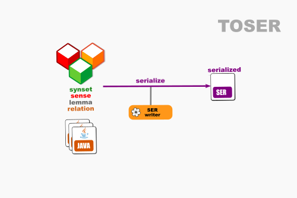

# OEWN model-to-SER

This writes a model to SER (serialized) format.

Project [toser](https://github.com/oewntk/toser)

## Dataflow

## Maven Central

		<groupId>io.github.oewntk</groupId>
		<artifactId>toser</artifactId>
		<version>2.1.2</version>
